# CoderDojo Zenのイベント登録方法

## アカウント登録
### 保護者のアカウントを登録する
[http://zen.coderdojo.com](http://zen.coderdojo.com)にアクセスして、右上の"REGISTER"をクリックします。

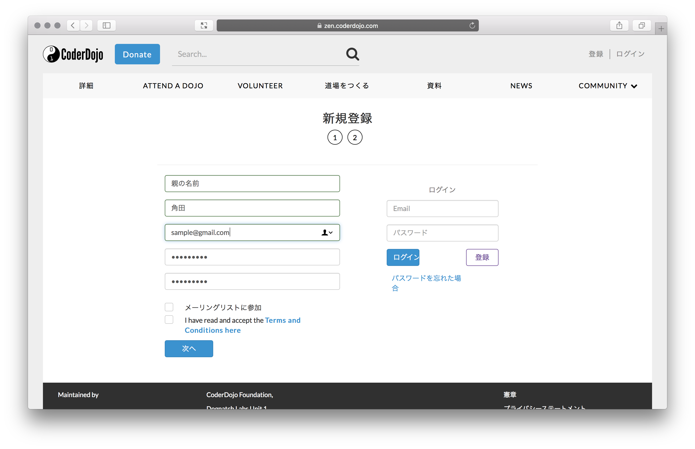
登録画面１ページ目。保護者の情報を入力して、次へボタンを押します。
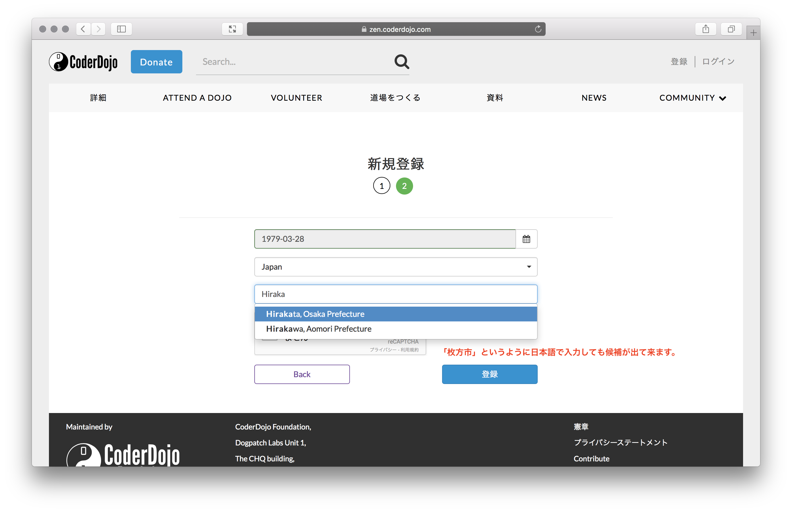
登録画面２ページ目。所在地を入力します。
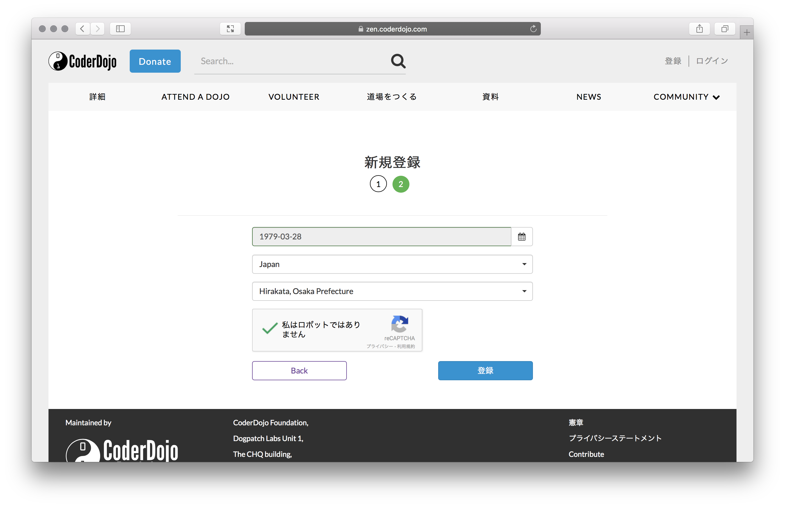
「私はロボットではありません」をチェックすると、画像を選択する設問が表示されますので、回答して、登録ボタンを押します。  
これで登録完了です。

### お子さんを登録する
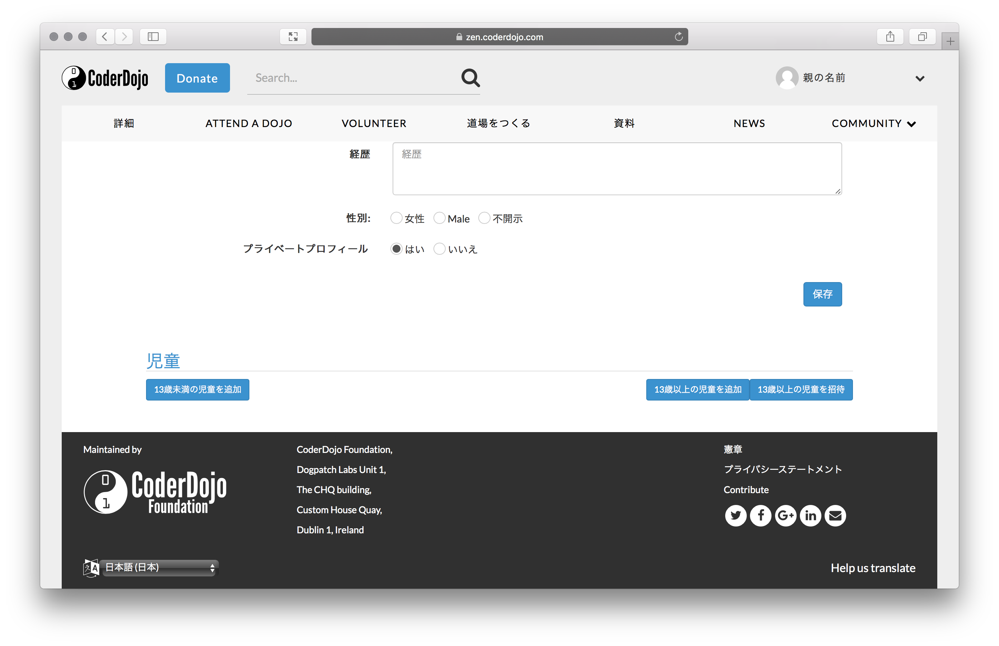
保護者アカウント登録後、もしくはログイン後右上のアイコンから"MY PROFILE"を選択すると、プロフィール編集画面が表示されます。最下部に児童を追加するボタンがありますので、クリックします。

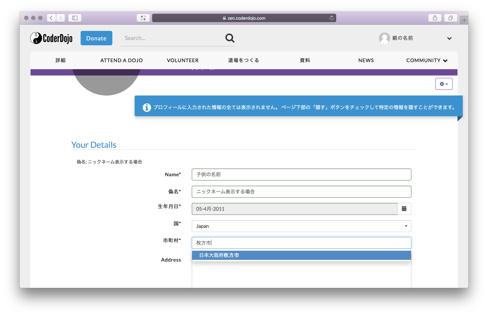
お子さんの情報を入力します。実名を隠したい場合は、偽名部分にニックネームを入力すると、プロフィール画面で偽名を表示します。
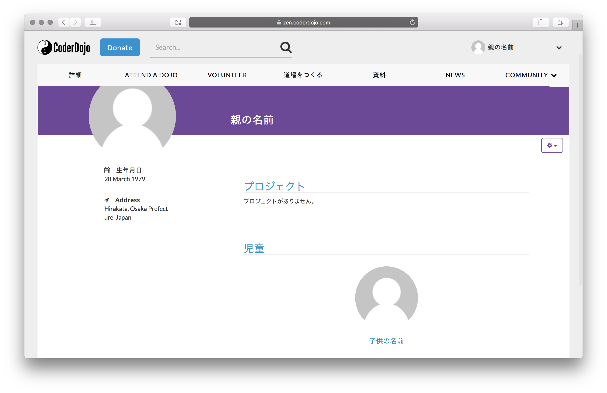
保存ボタンを押すと、保護者アカウントにお子さんが紐づけられます。

## イベント登録
### CoderDojo枚方に参加する
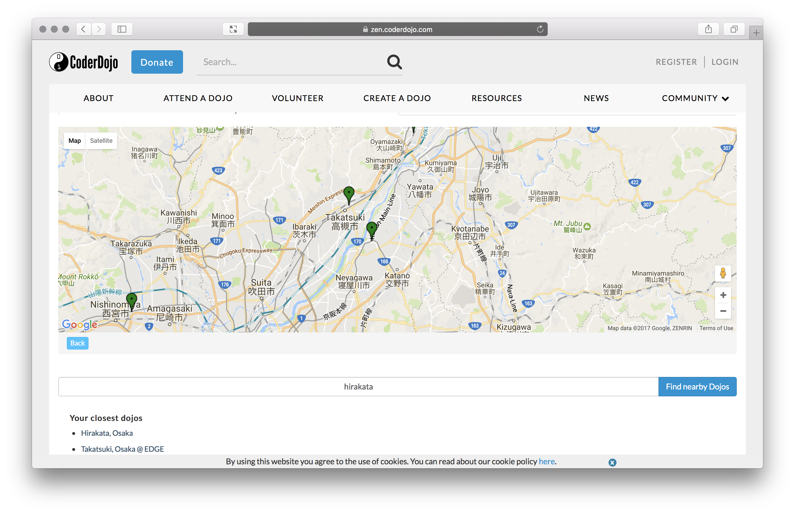
[http://zen.coderdojo.com](http://zen.coderdojo.com)にアクセスして、真ん中あたりにあるテキストボックスに"hirakata"と入力して検索ボタンを押します。  
検索結果に、Hirakata Osakaが出てきますので、クリックします。

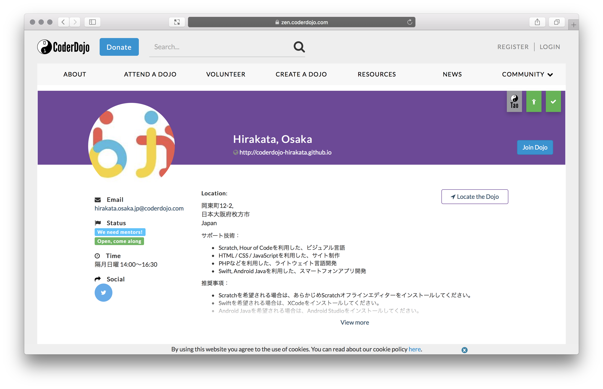
CoderDojo枚方に参加していない場合、道場詳細画面の右上に"道場に参加"というボタンが表示されるので、クリックします。

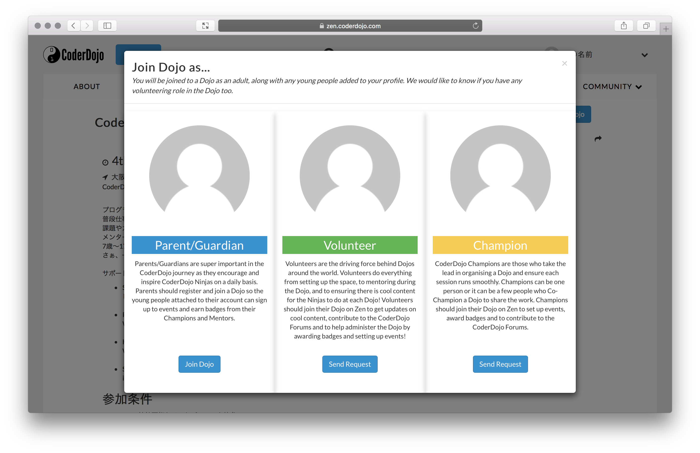
どの役割で参加するか選択できます。左側のParent/Guardianで登録します。

### ワークショップに参加する
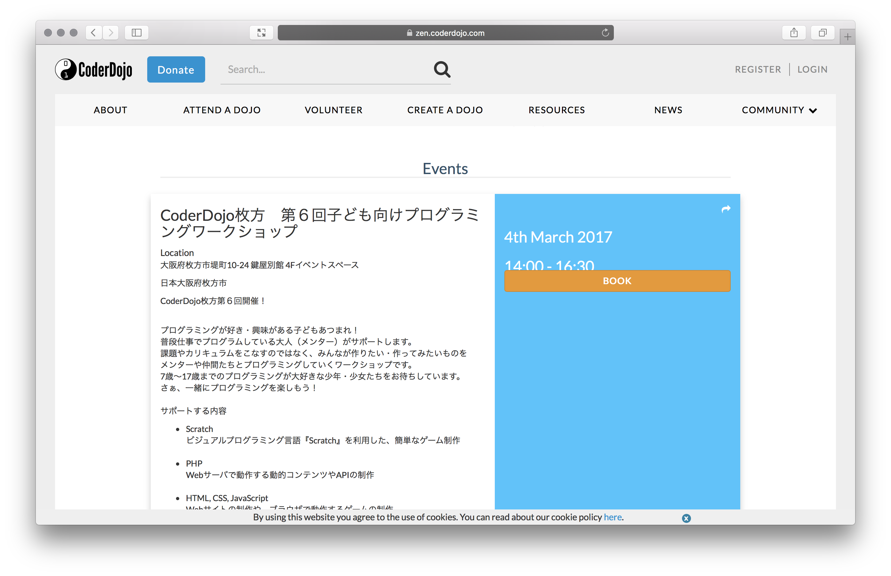
ワークショップに申込可能な場合は、CoderDojo枚方の詳細ページの真ん中あたりに参加できるワークショップ一覧が表示されます。参加するワークショップの"予約"ボタンをクリックします。

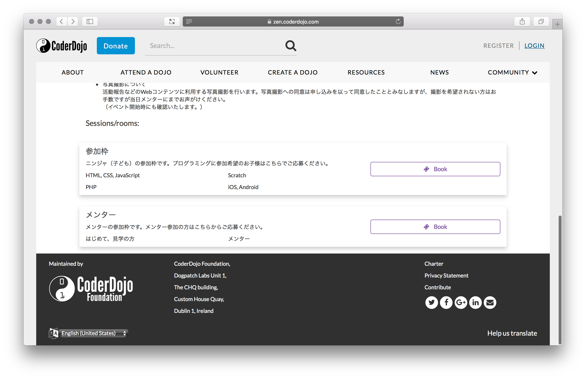
参加枠にある"予約"ボタンをクリックします。

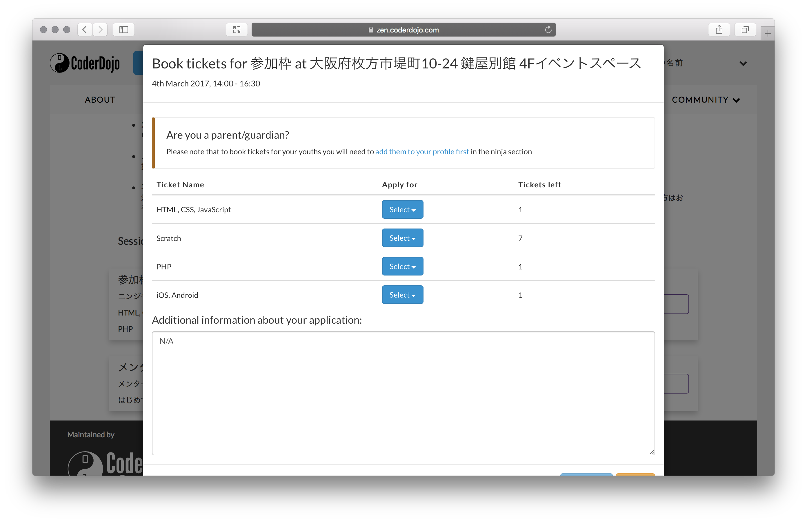
参加したい言語の一覧が表示されますので、その行の"Select"を選択肢、参加させたいお子さんを選びます。テキストエリアに、お手数ですがお住いの地域を入力ください。入力後、"今すぐ応募"ボタンをクリックして、応募完了です。  

### 当日参加
参加可能となりましたら、メールをお送りしますのでご確認ください。
メールをお送りした方のみ参加となりますので、ご注意ください。
